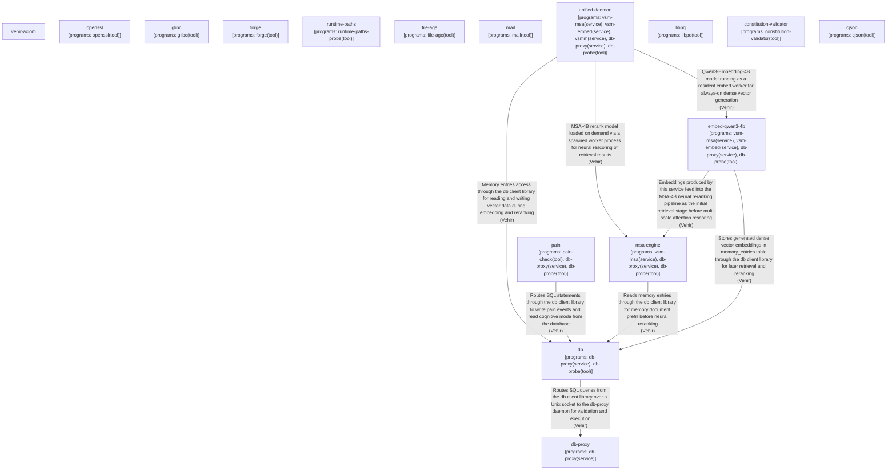
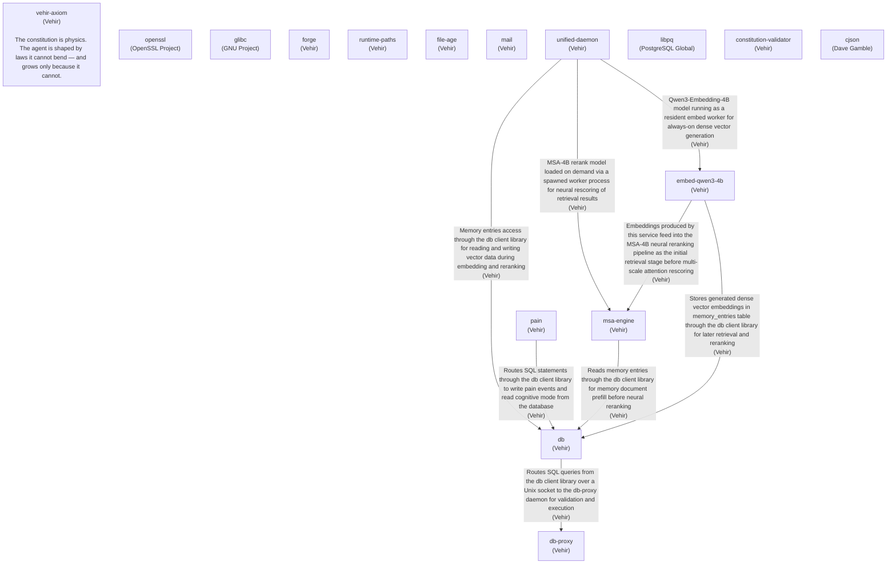
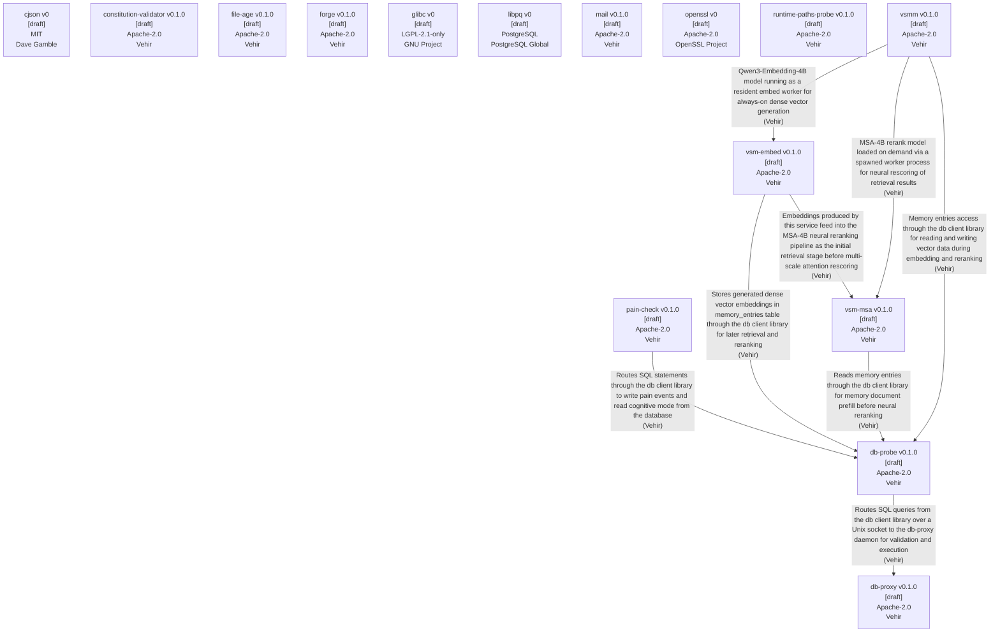

# Vehir — Core Operational Physics

Package graph of LLM agent runtime. Managed by [IPM](https://github.com/grigoriitropin/IPM).

## Architecture

- **Profile manager** — atomic generation symlink-farm, isolated per workspace
- **ipm-loader** — Stage 1 anti-brick, rollback works even if core is dead
- **Pre-flight check** — binary verified before every activation
- **Embedded SQL migrations** — advisory lock, version drift barrier
- **Audit journal** — append-only JSONL, auto-purge 30 days

## Graph

# Graph


### Ideas

# Ideas


### Programs

# Programs

  openssl["openssl\n[programs: openssl(tool)]"]
  glibc["glibc\n[programs: glibc(tool)]"]
  forge["forge\n[programs: forge(tool)]"]
  runtime-paths["runtime-paths\n[programs: runtime-paths-probe(tool)]"]
  file-age["file-age\n[programs: file-age(tool)]"]
  mail["mail\n[programs: mail(tool)]"]
  db-proxy["db-proxy\n[programs: db-proxy(service)]"]
  db["db\n[programs: db-proxy(service), db-probe(tool)]"]
  unified-daemon["unified-daemon\n[programs: vsm-msa(service), vsm-embed(service), vsmm(service), db-proxy(service), db-probe(tool)]"]
  embed-qwen3-4b["embed-qwen3-4b\n[programs: vsm-msa(service), vsm-embed(service), db-proxy(service), db-probe(tool)]"]
  libpq["libpq\n[programs: libpq(tool)]"]
  constitution-validator["constitution-validator\n[programs: constitution-validator(tool)]"]
  msa-engine["msa-engine\n[programs: vsm-msa(service), db-proxy(service), db-probe(tool)]"]
  pain["pain\n[programs: pain-check(tool), db-proxy(service), db-probe(tool)]"]
  cjson["cjson\n[programs: cjson(tool)]"]
  db -->|"Routes SQL queries from the db client library over a Unix socket to the db-proxy daemon for validation and execution\n(Vehir)"| db-proxy
  unified-daemon -->|"MSA-4B rerank model loaded on demand via a spawned worker process for neural rescoring of retrieval results\n(Vehir)"| msa-engine
  embed-qwen3-4b -->|"Embeddings produced by this service feed into the MSA-4B neural reranking pipeline as the initial retrieval stage before multi-scale attention rescoring\n(Vehir)"| msa-engine
  unified-daemon -->|"Memory entries access through the db client library for reading and writing vector data during embedding and reranking\n(Vehir)"| db
  unified-daemon -->|"Qwen3-Embedding-4B model running as a resident embed worker for always-on dense vector generation\n(Vehir)"| embed-qwen3-4b
  pain -->|"Routes SQL statements through the db client library to write pain events and read cognitive mode from the database\n(Vehir)"| db
  msa-engine -->|"Reads memory entries through the db client library for memory document prefill before neural reranking\n(Vehir)"| db
  embed-qwen3-4b -->|"Stores generated dense vector embeddings in memory_entries table through the db client library for later retrieval and reranking\n(Vehir)"| db
```


[Interactive: Combined](docs/graph-combined.html) · [Ideas](docs/graph-ideas.html) · [Programs](docs/graph-programs.html)

